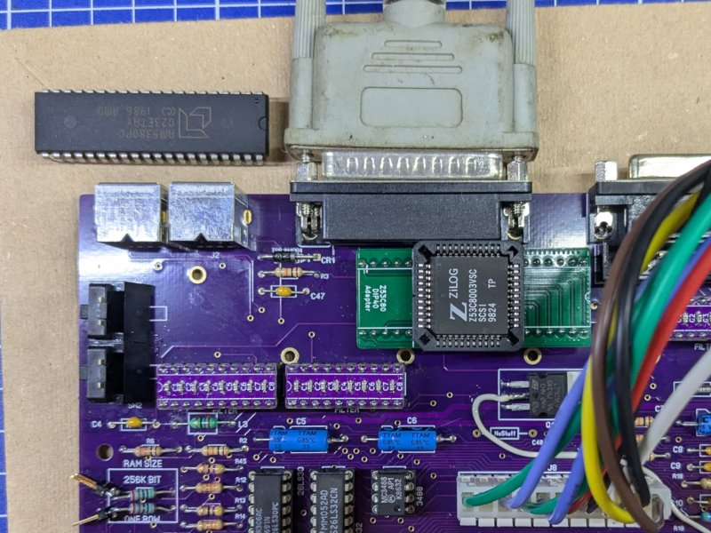

# Z53C80 PLCC to DIP40 adapter

## DISCLAIMER

Any use of this project is **under your own responsibility**.
You will be responsible of checking the correct construction and functionality of your board and the compatiblity of the chips You will insert into it.
By using this project You will agree that I cannot be held responsible if it will destroy any of your devices, damage your computer, burn down your house or whatever.

## Introduction

Building a Macintosh Plus clone, I noticed that 53C80 SCSI ICs in PLCC format are much more readily available than ones in DIP-40 package, required by the Mac Plus motherboard.

This adapter is just a pin-to-pin adapter that allows you to use a PLCC package in place of a DIP-40 one.

## Hardware

First of all, solder the ceramic capacitor, then the headers. My advice is to insert them into a DIP40 socket to hold them still, fit the PCB on top of them, then **snip off all the posts overlapping with where the PLCC socket would sit**.
Once that is done, solder the headers, and avoid adding too much solder to the stubs near the space for the PLCC socket.

Insert the PLCC socket on top of the board, apply flux liberally and solder every pin, paying particular attention not to short them to the nearby headers.

Done.

### Bill of Materials

| Component         | Qty | Type / Value                   |
| ----------------- | --- | ------------------------------ |
| 20 pin header     |  2  | Machined pin headers           |
| PLCC44 socket     |  1  | Through hole PLCC 44 pin socket|
| C1                |  1  | 100nF / 1206 / ceramic         |
